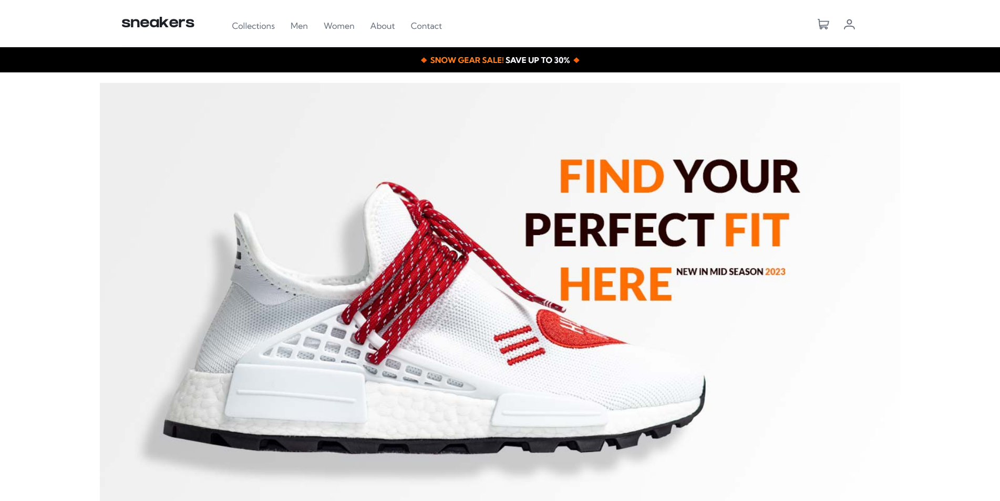
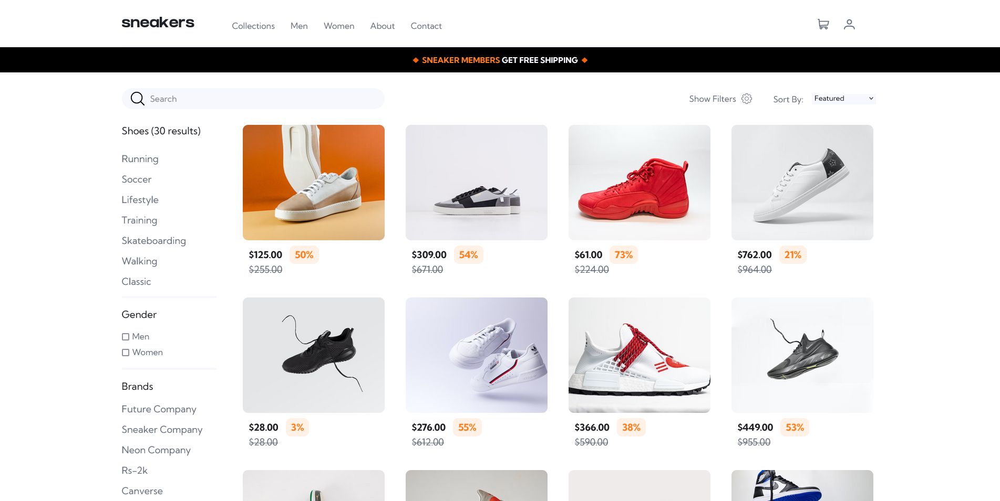

# Sneakers E-commerce

    

# ScreenShot

    
    

## 📃Project Overview

The shoe e-commerce project is a web-based application built with Vue, Vuex, Vue Router, TypeScript, and authentication. The application allows users to browse, purchase, and manage shoes, using features such as product categories, search, cart management, and user accounts. The application is built using TypeScript and Vuex to manage the state and Vue Router for routing, with authentication to secure user data.

## 📋Features:

Your users should be able to:

- View the optimal layout for the site depending on their device's screen size
- See hover states for all interactive elements on the page
- Open a lightbox gallery by clicking on the large product image
- Switch the large product image by clicking on the small thumbnail images
- Add items to the cart
- View the cart and remove items from it
