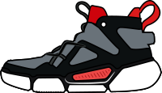

 

  

  <h2 align="center">Sneaker E-commerce</h2>
  
A shoe e-commerce app with a free API serving a collection of sneakers.

   
      <a href="https://github.com/Mod8124/freeShoesApi">Explore the shoes API</a>
    ·
    <a href="https://github.com/Mod8124/Shoes-E-commerce/issues">Bug report</a>
    ·
    <a href="https://www.frontendmentor.io/solutions/intro-section-with-dropdown-navigation-tmQXOQU78e">Frontend Mentor Challenge</a>
  

     
     
      
      
      
      
      
      
  

    
    

## 📃Project Overview

Developed & designed a sneaker e-commerce app inspired in <a href="https://www.frontendmentor.io/challenges/ecommerce-product-page-UPsZ9MJp6">Frontend Mentor</a> challenge, built <a href="https://github.com/Mod8124/freeShoesApi">API</a> for providing all the sneakers, utilizing NodeJs on the server-side, and the client-side with Vue via an API. Implemented design features, state management, router, and CSS methodology like BEM in SASS.

<a href="https://github.com/Mod8124/freeShoesApi">See docs for shoes' API</a>

## 📋Features:

Your users should be able to:

- View the optimal layout for the site depending on their device's screen size
- See hover states for all interactive elements on the page
- Open a lightbox gallery by clicking on the large product image
- Switch the large product image by clicking on the small thumbnail images
- Add items to the cart
- View the cart and remove items from it
